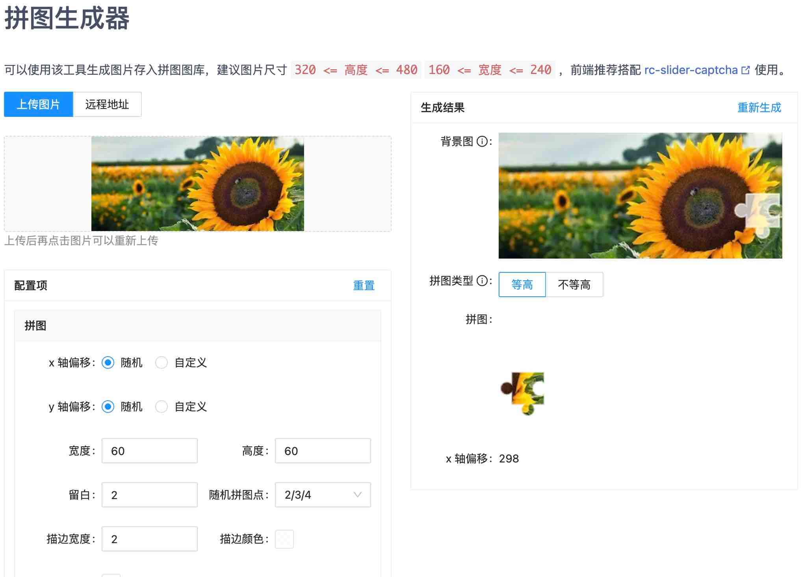

# create-puzzle

[![npm][npm]][npm-url] 

在浏览器端生成滑块验证码的拼图和背景图。

可以在客户端生成拼图，也可以使用它生成的拼图放到服务端图库，推荐搭配 [rc-slider-captcha] 使用。

如果你使用的是 Node.js 做服务端，推荐使用 [`node-puzzle`](https://www.npmjs.com/package/node-puzzle)。

## 在线示例

- [文档站点][site]
- [拼图生成器][generator]

[][generator]

## 使用

### es

安装依赖

```shell
npm install create-puzzle
```

```shell
yarn add create-puzzle
```

```shell
pnpm add create-puzzle
```

项目中使用

```typescript
import { createPuzzle } from 'create-puzzle';

createPuzzle(imgUrl).then((res) => {
  console.log(res);
  // {
  //   bgUrl:  "data:image/jpeg;base64,/9j/4AAQSk...",
  //   puzzleUrl :  "data:image/png;base64,iVBORw0KGgo...",
  //   x: 60,
  //   y: 0
  // }
});
```

### 原生 js 开发环境

如果你的项目使用的是原生方式开发，可以在浏览器中使用 `script` 标签直接引入文件，并使用全局变量 `createPuzzle` 。

npm 包的 `dist` 目录下提供了 UMD 包 `createPuzzle.js` 以及 `createPuzzle.min.js`。你也可以通过 [UNPKG](https://unpkg.com/create-puzzle/dist/) 下载到本地进行使用。或者直接使用 [UNPKG 线上版本](https://unpkg.com/create-puzzle@latest/dist/createPuzzle.min.js)<sup>注意版本</sup>。

## API

```javascript
import { createPuzzle, Options, Result, Point, clearCache } from 'create-puzzle';

function createPuzzle(imgUrl: string | Blob, options?: Options): Promise<Result>;

type Options = {
  // 拼图
  borderWidth?: number; // 描边宽度。默认 2
  borderColor?: string; // 描边颜色。默认 rgba(255,255,255,0.7)
  fillColor?: string; // 填充颜色。默认 rgba(255,255,255,0.7)
  points?:  2 | 3 | 4 | {
    top: Point;
    right: Point;
    bottom: Point;
    left: Point;
  }; // 拼图点，不传默认随机2/3/4
  width?: number;  // 宽度。默认 60
  height?: number; // 高度。默认 60
  x?: number; // x 轴偏移值，如果不传内部随机生成。
  y?: number; // y 轴偏移值，如果不传内部随机生成。
  margin?: number;  // 上下左右留白。默认 2

  // 背景图
  bgWidth?: number; // 背景图宽度。默认 图片宽度
  bgHeight?: number; // 背景图高度。默认 图片高度
  bgOffset?: [number, number] | ((imgWidth: number, imgHeight: number) => [number, number]); // 背景图偏移值。 默认 [0,0]

  // 上传的图片
  imageWidth?: number; // 自定义输入图片宽度。
  imageHeight?: number; // 自定义输入图片高度。
  cacheImage?: boolean; // 缓存最近加载成功的图片，最大缓存数量为 5 ，可使用 clearCache 清理缓存。默认为 true 。
  ajaxOptions?: AjaxOptions; // ajax 请求配置项，当传入的图片为字符串时才会触发请求。更多信息可查阅： https://doly-dev.github.io/util-helpers/global.html#AjaxOptions

  // 导出图片
  bgImageType?: string; // 背景图导出类型。默认 image/jpeg
  quality?: number; // 导出图片质量。默认 0.8 。
  format?: 'dataURL' | 'blob'; // 导出图片格式。默认 dataURL 。
  autoRevokePreviousBlobUrl?: boolean; // 自动释放之前导出的 blob url ，仅在 format='blob' 时生效。默认 true 。
}

type Result = {
  bgUrl: string; // 背景图
  puzzleUrl: string; // 拼图
  x: number; // x 轴偏移值。如果使用该值校验，建议前后阈值增减 5 的范围
  y: number; // y 轴偏移值，等高拼图时值始终为 0
}

// 拼图点
enum Point {
  None,    // 没有
  Outer, // 外部
  Inner  // 内部
}
```

[site]: https://caijf.github.io/create-puzzle/index.html
[generator]: https://caijf.github.io/create-puzzle/index.html#/generator
[rc-slider-captcha]: https://caijf.github.io/rc-slider-captcha/
[npm]: https://img.shields.io/npm/v/create-puzzle.svg
[npm-url]: https://npmjs.com/package/create-puzzle
